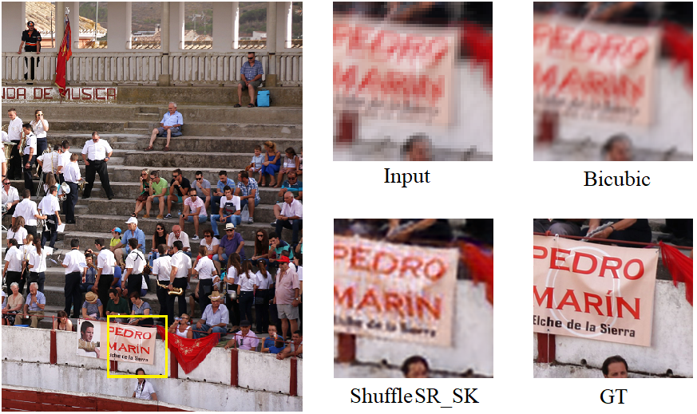
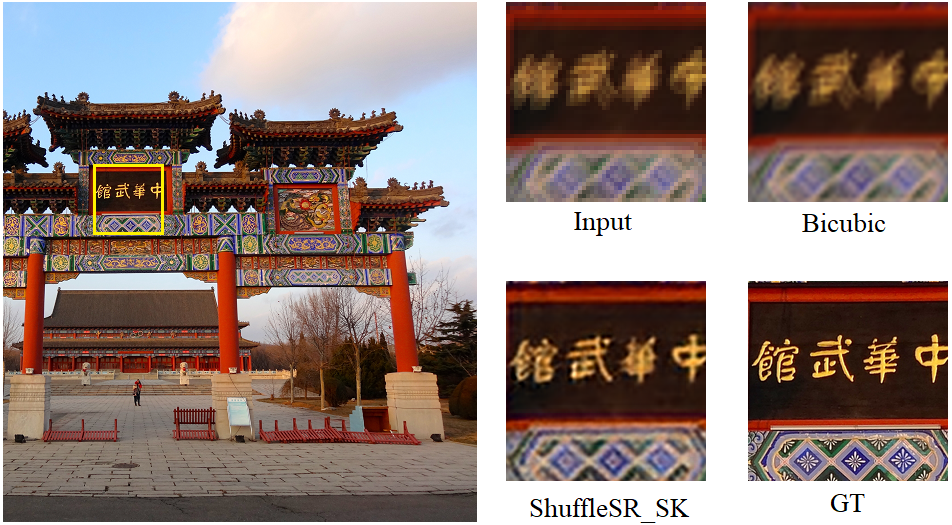
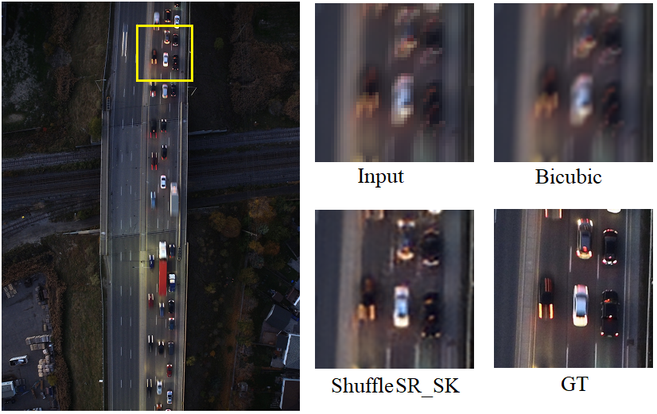
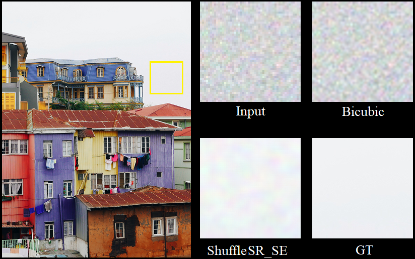
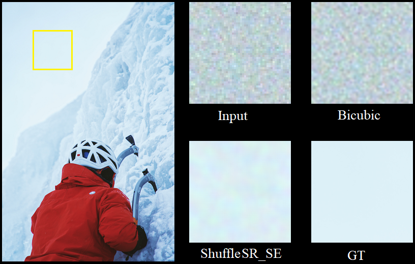
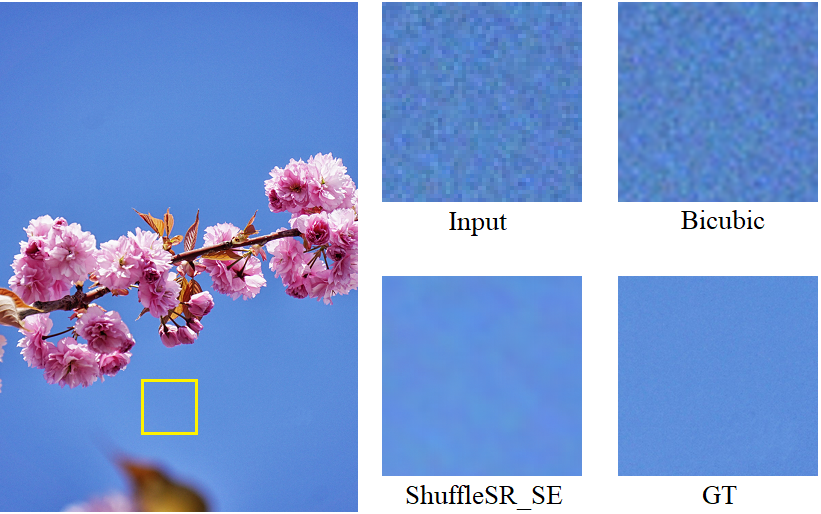

# ShuffleSR

- <strong>Lighter</strong> and <strong>better</strong> image super-resolution algorithm than [WDSR](https://github.com/JiahuiYu/wdsr_ntire2018)

<br>

## Performance

- Training and validation results on [DIV2K](https://data.vision.ee.ethz.ch/cvl/DIV2K/) dataset

**DIV2K Mild X4**

|name|PSNR|SSIM|Flops|parms|checkpoint|
|:---:|:---:|:---:|:---:|:---:|:---:|
|Bicubic|17.6147|0.4268|-|-|-|
|ShuffleSR|18.7887|0.4857|<strong>126.5M</strong>|<strong>56.5K</strong>|ShuffleSR_Mild_X4.pth|
|ShuffleSR_SE|<strong>18.8280</strong>|0.5078|128.2M|158.9K|ShuffleSR_SE_Mild_X4.pth|
|ShuffleSR_SK|18.7890|<strong>0.5094</strong>|165.0M|152.2K|ShuffleSR_SK_Mild_X4.pth|
|WDSR|18.7757|0.4975|381.5M|167.7K|WDSR_Mild_X4.pth|

<br>

**DIV2K Unknown X4**

|name|PSNR|SSIM|Flops|parms|checkpoint|
|:---:|:---:|:---:|:---:|:---:|:---:|
|Bicubic|21.7511|0.5561|-|-|-|
|ShuffleSR|24.8454|0.7025|<strong>129.2M</strong>|<strong>58.4K</strong>|ShuffleSR_Unknown_X4.pth|
|ShuffleSR_SK|<strong>26.4377</strong>|<strong>0.7542</strong>|165.0M|152.2K|ShuffleSR_SK_Unknown_X4.pth|
|ShuffleSR_SE|25.6780|0.7292|128.2M|158.9K|ShuffleSR_SE_Unknown_X4.pth|
|WDSR|25.2512|0.7152|381.5M|167.7K|WDSR_Unknown_X4.pth|


<br>

**DIV2K Bicubic X4**

|name|PSNR|SSIM|Flops|parms|checkpoint|
|:---:|:---:|:---:|:---:|:---:|:---:|
|Bicubic|26.6952|0.7663|-|-|-|
|ShuffleSR|28.2402|0.8135|<strong>126.5M</strong>|<strong>56.5K</strong>|ShuffleSR_Bicubic_X4.pth|
|ShuffleSR_SK|28.3443|0.8170|165.0M|152.2K|ShuffleSR_SK_Bicubic_X4.pth|
|WDSR|28.4477|0.8186|381.5M|167.7K|WDSR_Bicubic_X4.pth|
|ShuffleSR_M|<strong>28.4664</strong>|<strong>0.8192</strong>|342.4M|152.1K|ShuffleSR_M_Bicubic_X4.pth|


<br>

**DIV2K Bicubic X2**

|name|PSNR|SSIM|Flops|parms|checkpoint|
|:---:|:---:|:---:|:---:|:---:|:---:|
|Bicubic|31.0374|0.9015|-|-|-|
|ShuffleSR|33.7818|0.9358|<strong>122.0M</strong>|<strong>54.8K</strong>|ShuffleSR_Bicubic_X2.pth|
|ShuffleSR_SK|33.8937|0.9368|168.2M|188.0K|ShuffleSR_SK_Bicubic_X2.pth|
|WDSR|33.9800|0.9373|351.2M|154.5K|WDSR_Bicubic_X2.pth|
|ShuffleSR_M|<strong>34.0213</strong>|<strong>0.9376</strong>|321.1M|143.0K|ShuffleSR_M_Bicubic_X2.pth|


<br>

## Network super parameter

|network|features|expand|blocks|
|:---:|:---:|:---:|:---:|
|ShuffleSR_SE_Unknown_X4|40|2|8|
|ShuffleSR_SE_Mild_X4|40|2|8|
|ShuffleSR_SK_Bicubic_X2|48|2|8|
|ShuffleSR_SK_Bicubic_X4|40|2|8|
|ShuffleSR_SK_Unknown_X4|40|2|8|
|ShuffleSR_SK_Mild_X4|40|2|8|
|ShuffleSR_Bicubic_X2|48|2|8|
|ShuffleSR_Bicubic_X4|40|2|8|
|ShuffleSR_Unknown_X4|28|3|12|
|ShuffleSR_Mild_X4|40|2|8|
|ShuffleSR_M_Bicubic_X2|68|3|8|
|ShuffleSR_M_Bicubic_X4|68|3|8|
|WDSR_Bicubic_X2|32|6|8|
|WDSR_Bicubic_X4|32|6|8|
|WDSR_Unknown_X4|32|6|8|
|WDSR_Mild_X4|32|6|8|

<br>

## Usage
- Git clone

```
cd /path/to/ShuffleSR
```

<br>

- Install requirement

```
pip install -r requirement.txt
```

<br>

- Download data set [DIV2K](https://data.vision.ee.ethz.ch/cvl/DIV2K/)

**Replace '/path/to/xx' in the code with your path**

<br>

- Train
```
help:
python train.py -h

examples:
# train new model
python train.py --network ShuffleSR_SE --features 32 --expand 3 --block 8
python train.py --network ShuffleSR --features 32 --expand 6 --block 8 --lr 0.001
python train.py --network WDSR --features 32 --expand 3 --block 8 --epochs 100

# load model and retrain
python train.py --load_model_path checkpoint/ShuffleSR_Bicubic_X2.pth
python train.py --load_model_path checkpoint/WDSR_Mild_X4.pth
```

<br>

- Test

**set `model_path` and `output_path` in the `output.py`** 
 
```
python output.py
```

<br>

## ShuffleSR SR result

### DIV2K Unknown X4 
- 0825.png



<br>

- 0826.png



<br>

- 0827.png



<br>

- 0832.png


<br>

### DIV2K Mild X4 

- 0836.png



<br>

- 0844.png



<br>

- 0898.png


